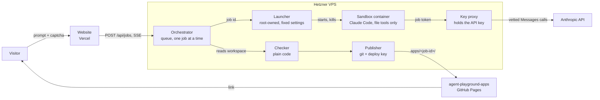

# Agent Playground

Type a request such as "a 5-minute timer with a QR code" and get a link to a working, deployed web app a few minutes later. A coding agent (Claude Code, headless) builds it; everything around the agent is ordinary, deterministic code.

The project is built on one assumption: **every prompt is malicious and the agent can be fully hijacked.** Nothing the agent can reach is worth stealing, and nothing it produces is published without passing checks it has no influence over.

## How a request flows



1. The website sends the prompt and a Turnstile token to the orchestrator.
2. The orchestrator applies the limits, queues the job and streams progress back (`queued → preparing → coding → checking → publishing → done`), including the files the agent writes.
3. For each job a fresh container starts with an empty workspace. The agent has the Read, Write, Edit, Glob and Grep tools and nothing else.
4. When the agent stops, the checker validates the workspace. If it finds problems, the agent gets one repair round with the findings.
5. The publisher commits the checked files to `apps/<job-id>/` in a dedicated repository and waits until GitHub Pages serves them.

## Security model

| Concern | What is done about it |
| --- | --- |
| Agent runs commands or reaches the network | No shell or web tools (`--restricted`, fixed tool list baked into the image). Container: non-root, read-only root filesystem, all capabilities dropped, memory, CPU and process limits. Its network is internal with no gateway on the host, so the only reachable address is the key proxy. |
| Agent steals the API key | The key exists only in the proxy's environment. The container gets an HMAC-signed token bound to the job id and the job deadline. |
| Agent abuses the API through the proxy | Only `POST /v1/messages` is forwarded. Model allow-list, `max_tokens` cap, request and output-token budget per job. Requests that carry server tools (web search, web fetch, code execution) or MCP servers are refused, since those would give the sandbox a way out through Anthropic's side. |
| Web-facing process gets compromised | The orchestrator has no Docker access. It can only ask a root-owned launcher to start or kill the container for a job id; image, network, limits and mounts are fixed there. |
| Agent gets at git or GitHub | The image has no git and no credentials. The orchestrator publishes with a deploy key that is valid for the apps repository only. |
| Malicious output is published | The checker allows only `.html`, `.css`, `.js`, `.json` and `.txt` within size and count limits, rejects symlinks, secrets, inline scripts, external or absolute URLs, iframes, password and card fields, and forms that submit anywhere. HTML is re-serialised with a strict CSP (`connect-src 'none'`, `form-action 'none'`, `script-src 'self'`) and a visible "AI-generated" badge. |
| Injection through the prompt | The prompt reaches the agent on stdin only. Job ids are generated server-side and are the only request-derived value in any path or command. Every subprocess is started with an argument array, never through a shell. |
| Abuse and cost | Turnstile, per-visitor and global hourly/daily limits, a bounded queue, one job at a time, a hard timeout that kills the container, and a spend limit on the dedicated Anthropic workspace. |

The full reasoning, including the trade-offs that remain, is in [docs/threat-model.md](docs/threat-model.md).

## Repository layout

| Path | Contents |
| --- | --- |
| `web/` | The website: Vite, TypeScript, no framework. Deployed to Vercel. |
| `orchestrator/` | API, queue, sandbox runner, checker, publisher and the key proxy (Node 22, TypeScript, Fastify, built-in SQLite). |
| `sandbox/` | Image for the agent container, its system prompt and the bundled libraries. |
| `infra/` | Provisioning and deploy scripts, sandbox launcher, Caddy config, systemd unit, compose file. |

## Development

```sh
nvm use

cd orchestrator
npm ci
npm test          # checker, proxy, launcher, token, API and queue tests
npm run typecheck

cd ../web
npm ci
npm run dev       # expects the API on http://localhost:8787
```

The tests cover the parts that carry the security claims: what the checker rejects, what the proxy refuses to forward, the limits of the API, and the flags the sandbox is started with.

## Deployment

On a fresh Ubuntu 24.04 server:

```sh
sudo API_DOMAIN=api.agent-playground.example WEB_ORIGIN=https://agent-playground.example ./infra/provision.sh
# add the printed deploy key to the apps repository (write access)
# put the Anthropic key into /etc/agent-playground/anthropic.env
# put the Turnstile secret into /etc/agent-playground/orchestrator.env
sudo ./infra/deploy.sh
```

The website is a Vercel project with `web/` as its root directory and `VITE_API_BASE` and `VITE_TURNSTILE_SITEKEY` set.

## Limits

| Setting | Default |
| --- | --- |
| Jobs running at once | 1 |
| Job timeout | 10 minutes |
| Jobs per visitor | 3 per hour |
| Jobs overall | 10 per hour, 30 per day |
| Queue length | 10 |
| Prompt length | 1,000 characters |
| App size | 30 files, 300 kB per file, 1.5 MB in total |
